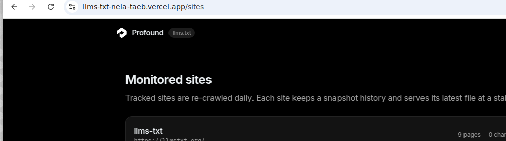
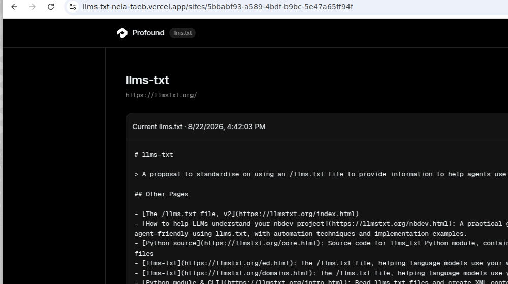

# llms.txt Generator

**Live app: https://llms-txt-nela-taeb.vercel.app**

Paste a website URL, get a spec-compliant [`llms.txt`](https://llmstxt.org/) back — then keep it
monitored so it is regenerated when the site changes.

- **Generate** — crawls the site (sitemaps first, link crawl as fallback), extracts metadata,
  groups pages into sections, and renders `llms.txt` (plus optional `llms-full.txt`).
- **Validate** — every generated file is checked against the spec and the results are shown in the UI.
- **Monitor** — a site can be tracked; a daily cron re-crawls it, diffs the pages, and stores a new
  snapshot only when something actually changed. The latest file is served at `/s/{siteId}/llms.txt`.

## Screenshots

Generating a file (tryprofound.com, 120 pages, spec compliant):


Monitored sites and a site's snapshot history:




## Quick start

```bash
npm install
npm run dev          # http://localhost:3000
```

No configuration is required: without a database the app keeps jobs and monitored sites in memory,
and without an LLM key it uses heuristics for titles, sections and descriptions.

Other scripts:

```bash
npm run build      # production build
npm run test       # vitest unit tests
npm run lint       # eslint
npm run typecheck  # tsc --noEmit
```

## Configuration

All environment variables are optional (see `.env.example`):

| Variable | Purpose | Without it |
| --- | --- | --- |
| `DATABASE_URL` | Neon/Postgres connection string; persists jobs, sites and snapshots | in-memory store, data lost on restart |
| `OPENAI_API_KEY` | Enables LLM-assisted titles, section names and descriptions | heuristic grouping (fully functional) |
| `OPENAI_MODEL` | Model used for enrichment | `gpt-4o-mini` |
| `CRON_SECRET` | Required as `Authorization: Bearer …` on `/api/cron/refresh` | the endpoint is unauthenticated |

Schema creation is automatic — the Postgres store creates its tables on first use.

## Deployment (Vercel + Neon)

1. Push this repo to GitHub and import it in Vercel (framework preset: Next.js).
2. Create a Neon Postgres database and set `DATABASE_URL` in the Vercel project (all environments).
3. Set `CRON_SECRET` to a random string. Vercel sends it automatically to cron routes.
4. Deploy. `vercel.json` registers a daily cron at 03:00 UTC hitting `/api/cron/refresh`, which
   re-crawls every monitored site and stores a snapshot when the content hash changes.

## How it works

```
URL → crawl (robots + sitemap + links) → extract → classify/rank → group → render → validate
                                                                        ↑
                                                            optional LLM enrichment
```

- **`src/lib/robots.ts`** — robots.txt parser (user-agent groups, wildcards, `$`, crawl-delay capped
  at 2s, sitemap hints). Crawling honours it by default.
- **`src/lib/sitemap.ts`** — sitemap discovery from robots.txt and common paths; handles sitemap
  indexes, gzip, XML entities/CDATA and plain-text sitemaps.
- **`src/lib/crawl.ts`** — resumable, serializable crawl state. Each slice fetches a bounded batch
  within a time budget and returns the new state, so a crawl survives serverless request limits.
  Off-site redirects, non-HTML responses, `noindex` pages and out-of-scope URLs are dropped.
- **`src/lib/extract.ts`** — title, description (meta/OG/Twitter/JSON-LD), canonical, markdown
  alternates (`<link rel="alternate" type="text/markdown">` and `Link` headers), body vs. nav links,
  word count and a content hash used for change detection.
- **`src/lib/classify.ts`** — path-based page kinds (docs, api, guide, blog, product, company,
  support, legal…) and a ranking score combining kind, depth, inbound links, nav membership,
  sitemap presence, markdown availability and content length.
- **`src/lib/group.ts` / `generate.ts`** — sections, link budgets, a trailing `Optional` section for
  low-value pages, brand-suffix stripping, and the renderer that emits the H1/blockquote/H2 layout
  required by the spec. Markdown alternates are preferred as link targets.
- **`src/lib/llm.ts`** — optional enrichment. The model only ever picks from numbered candidate
  pages, so it cannot invent URLs; any failure falls back to the heuristic document.
- **`src/lib/validate.ts`** — the spec checker used by the UI and by `/api/validate`.
- **`src/lib/monitor.ts` / `diff.ts`** — snapshots, per-page added/removed/changed diffs, and the
  refresh routine shared by the manual button and the cron job.

### Design decisions

- **Sitemap-first, link-crawl fallback.** Sitemaps give breadth cheaply; link crawling covers sites
  without one and supplies nav/inbound-link signals used for ranking.
- **Slice-based crawling.** Keeps every request under serverless limits and makes progress visible
  in the UI instead of blocking on one long request.
- **LLM optional, never authoritative.** The heuristic path always produces a valid file; the LLM
  only relabels and regroups pages it was given.
- **Hash-based change detection.** Page-level hashes make diffs cheap and let monitoring skip
  writing a snapshot when nothing changed.

## API

| Route | Description |
| --- | --- |
| `POST /api/generate` | Starts a crawl, returns job id, progress and the result when done |
| `POST /api/jobs/{id}` | Advances a running crawl by one slice |
| `POST /api/validate` | Validates an arbitrary `llms.txt` document |
| `GET/POST /api/sites` | Lists monitored sites / adds one with a baseline snapshot |
| `POST /api/sites/{id}/refresh` | Re-crawls a site and diffs it against the last snapshot |
| `GET /s/{id}/llms.txt` | Serves the latest generated file as `text/plain` |
| `GET /api/cron/refresh` | Scheduled refresh of every monitored site |

## Tests

`npm run test` covers robots/sitemap parsing, metadata extraction, URL normalization,
classification and ranking, document generation, spec validation and snapshot diffing.
